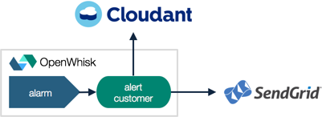

*阅读本文的其他语言版本：[English](README.md)。*

[](https://travis-ci.org/IBM/openfridge)

# 通过 OpenWhisk 和 Watson IoT 提供主动客户服务

这个项目演示了，在一个智慧家庭场景中[受 IBM Cloud 上的 Apache OpenWhisk 支持](https://bluemix.net/openwhisk/)的[无服务器技术](https://developer.ibm.com/opentech/2016/09/06/what-makes-serverless-attractive/)，电器将诊断读数发送到云，以供分析和执行主动维护。

该应用程序将 Watson IoT Platform、OpenWhisk 和 Cloud 服务集成到一个事件驱动的用例中，该用例由来自联网电器的状态消息所驱动。

这个项目着重演示无服务器编程模型，讨论此方法相较于处理 IoT 工作负载的传统云开发方法的优势。有关更多背景，请查阅 IBMCode 上的 [developer journey](https://developer.ibm.com/code/journey/power-smart-fridge/)。

您应该基本了解 OpenWhisk 编程模型。如果不了解，请[首先尝试 action、trigger 和 policy 演示](https://github.com/IBM/openwhisk-action-trigger-rule)。还需要一个 Cloud 账户并[在您的 PATH 上安装最新的 OpenWhisk 命令行工具 (`wsk`)](https://github.com/IBM/openwhisk-action-trigger-rule/blob/master/docs/OPENWHISK.md)。

如果仅对集成**[用于 Watson IoT MQTT 的 OpenWhisk 包](https://github.com/krook/openwhisk-package-mqtt-watson)** 感兴趣，可以在它自己的包存储库中找到它。

[](https://www.youtube.com/watch?v=0Sl4rWZYo8w)


## 组件
- IBM Code 上的 Watson IoT Platform
- IBM Cloud Functions 上的 Apache OpenWhisk
- IBM Code 上的 Cloudant NoSQL Service
- IBM Code 上的 SendGrid Email Service

## 通过 IoT 设备驱动的分析改进客户服务

物联网使得制造商及其客户能够将硬件设备连接到网络，以达到更高效的设备使用效果。在设备上运行的软件可与云中的分析功能相结合，改进客户服务质量，降低用户和制造商的维护成本。

在这个用例中，电器制造商主动管理来自客户家里的机器的诊断事件。联网的冰箱可以报告它需要维修一个零部件（比如滤水器需要替换，因为它的过滤器寿命读数很低）。这些消息事件可以触发分析逻辑来发送提醒（比如因为客户仍在保修期内，所以自动订购了一个替换件）。

基于服务器架构且事件驱动的计算是一种很有吸引力的 IoT 编程模型，因为它为开发人员提供了以下重要优势：

- **自动扩展** - 事件驱动的计算的一个主要优势是，无需预测需部署多少服务，随着互联网中增添的设备数量继续赶超人类数量，这个优势特别重要。应用程序（编写为单一功能）的实例数量可自动增加或减少来响应当前工作负载，在本例中也就是来自冰箱的读数。

- **减少了成本** - 事件驱动的成本模型使开发人员仅需为业务逻辑实际运行的时间付费。相比而言，在 PaaS 或 IaaS 模型中，为应对预期的需求高峰而配备的应用程序或服务，以及始终运行的应用程序或服务都需要付费 - 甚至在无法响应客户请求时亦需付费。

- **上市速度** - 无服务器编程促进快速开发并实行模块化和灵活化，这可以加快应用程序交付，因为开发人员能够将更多的精力放在创建应用程序上，花更少的精力去处理操作问题。

- **简化的维护** - 无服务器编程模型的部署单元是单个功能。这些功能可独立更新，而且可使用声明为trigger和policy的映射来组装或编排。

下图展示了 Watson IoT Platform 和 OpenWhisk 上构建的一个解决方案如何实现这种联网家庭用例，带来无服务器架构的优势。


## 主要工作流

冰箱定期将表明其零部件状态的诊断读数发送到云服务。它可以仅在达到某个阈值时发送这些消息（使用边缘分析），或者让云服务来确定其收到的所有读数的正常范围（云分析）。

```json
{
    "appliance_serial": "aaaabbbbcccc",
    "part_number": "ddddeeeeffff",
    "reading": "15",
    "timestamp": 1466632598
}
```

* [这条 JSON 消息](docs/sample-messages.txt) 由设备发送到 Cloud 上的 Watson IoT Platform 中的一个 MTQQ 主题，比如  `iot-2/evt/refrigerator-simulator/fmt/json`。设备也可以发送任意二进制格式以改善性能。

* 一个 Node.js Cloud Foundry 应用程序订阅冰箱设备的一个通配符事件主题，比如 `iot-2/type/+/id/+/evt/+/fmt/json`，该应用程序在收到新消息时触发 OpenWhisk 操作。（这里重用了来自 James Thomas 的 [OpenWhisk 和 MQTT 教程] (http://jamesthom.as/blog/2016/06/15/openwhisk-and-mqtt/) 的代码）。

    

* 来自该 Cloud Foundry 应用程序的消息事件触发一个[分析操作](actions/analyze-service-event.js)，而且它检查该消息以确定是否采取进一步行动。例如，如果过滤器寿命读数低于正常值，它就会在一个 Cloudant 数据库中创建一个新服务记录。

* 该服务记录的创建触发[另一个操作](actions/create-order-event.js)，以插入一个订单记录。它查询该服务记录，将该电器映射到它登记的所有者，以评估客户是否仍在保修期内。如果电器仍在保修范围内，它自动为该零部件创建一个已批准的订单。如果不在，它创建一个需要客户批准和支付的待处理订单。

* 新订单记录触发一个[通知操作](actions/alert-customer-event.js)。如果该电器在保修期内，该操作发送一封电子邮件告知用户该零部件已订购并发货。否则，它发送一封电子邮件要求所有者完成超出保修期的零部件的购买。

    

## 补充工作流

* 按计划，每天晚上触发一个[操作](actions/alert-customer-event.js)，以查找即将到期的保修计划（比如在未来 30 天内），并向客户发送一条提醒，建议他们在失去保修之前购买新支持计划。

* 数据库中的订单状态每次更改时（比如从 _ordered_ 进展到 _shipped_，再进展到 _delivered_），也可以根据需要使用这[同一个操作](actions/alert-customer-event.js) 来提醒客户。

    

## 结合各个工作流

将这些工作流结合在一起，演示了一个能通过 OpenWhisk、IBM Cloud 和 Watson 服务改进客户服务的端到端场景。


## 运行示例应用程序

1.[设置 Bluemix 服务（Cloudant、SendGrid、Watson IoT 和一个 Cloud Foundry 应用程序）](docs/BLUEMIX.md)。

2.[设置 OpenWhisk 操作、触发器和规则](docs/OPENWHISK.md)。

# 许可
[Apache 2.0](LICENSE.txt)
