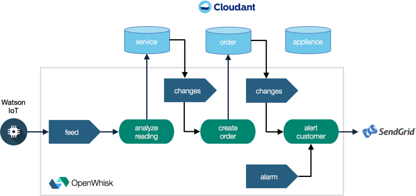

# Set up OpenWhisk actions, triggers, and rules

If you haven't already, download, install, and test the [`wsk` CLI tool](https://new-console.ng.bluemix.net/openwhisk/cli).

From this point forward, you can instead just run the following commands to set up the OpenWhisk resources with a deployment script:

- Make sure `local.env` is complete. Run `./deploy.sh --env` to see if all necessary variables are set.
- Create the actions, trigger, rules, and package bindings with `./deploy.sh --install`
- If you run into any issues installing run `./deploy.sh --uninstall` to start with a fresh environment.

Otherwise, read on if you want to understand how all the OpenWhisk actions, triggers, and rules come together or if you want to set them up yourself.

## Create feed action to handle the trigger

In this step we'll bind a feed action to that Cloud Foundry proxy app.

### Set a persistent variable for the feed consumer HTTP endpoint

- Change to the root of this repo and run `source local.env`
- `wsk property set --namespace $ORG\_$SPACE`
- `wsk package create -p provider_endpoint "http://$CF_PROXY_HOST.mybluemix.net/mqtt" mqtt`

### Create a feed action trigger that binds the feed provider proxy to OpenWhisk

- `wsk action create -a feed true mqtt/mqtt-feed-action actions/mqtt-feed-action.js`

## Create custom actions

Inside of the core OpenWhisk logic, we have the trigger we created above for the MQTT feed from the refrigerator via Watson IoT, along with 3 other triggers: Two are bound to changes in Cloudant databases, and one is bound to a nightly alarm. Both of these trigger types are built into the Bluemix OpenWhisk platform.

### Create the custom actions

- `wsk action update analyze-service-event analyze-service-event.js -p cloudant_user $CLOUDANT_USER -p cloudant_pass $CLOUDANT_PASS`
- `wsk action update create-order-event create-order-event.js -p cloudant_user $CLOUDANT_USER -p cloudant_pass $CLOUDANT_PASS`
- `wsk action update check-warranty-renewal check-warranty-renewal.js -p cloudant_user $CLOUDANT_USER -p cloudant_pass $CLOUDANT_PASS`
- `wsk action update alert-customer-event alert-customer-event.js -p cloudant_user $CLOUDANT_USER -p cloudant_pass $CLOUDANT_PASS -p sendgrid_api_key $SENDGRID_API_KEY`

### Test the actions

- Out of warranty in May 30

  - `wsk action invoke --blocking --result analyze-service-event -p service '{"appliance_serial": "aaaabbbbcccc", "part_number": "ddddeeeeffff", "reading": 15, "timestamp": 1466188262}'`

- In warranty till June 30

  - `wsk action invoke --blocking --result analyze-service-event -p service '{"appliance_serial": "llllmmmmnnnn", "part_number": "ddddeeeeffff", "reading": 14, "timestamp": 1466188262}'`

- In warranty till July 30

  - `wsk action invoke --blocking --result analyze-service-event -p service '{"appliance_serial": "xxxxyyyyzzzz", "part_number": "ddddeeeeffff", "reading": 13, "timestamp": 1466188262}'`

- `wsk action invoke --blocking --result create-order-event -p service '{"appliance_serial": "aaaabbbbcccc", "part_number": "ddddeeeeffff", "reading": 15, "timestamp": 1466188262}'`
- `wsk action invoke --blocking --result check-warranty-renewal`
- `wsk action invoke --blocking --result alert-customer-event`

## Create custom triggers and rules

### Create the trigger for the feed action

- `wsk trigger create openfridge-feed-trigger --feed /$ORG\_$SPACE/mqtt/mqtt-feed-action -p topic 'iot-2/type/+/id/+/evt/+/fmt/json' -p url 'tcp://$WATSON_TEAM_ID.messaging.internetofthings.ibmcloud.com:1883'`

### Create the triggers for the Cloudant feeds

- `wsk property set --namespace $ORG\_$SPACE`
- `wsk package bind /whisk.system/cloudant $CLOUDANT_INSTANCE -p username $CLOUDANT_USER -p password $CLOUDANT_PASS -p host $CLOUDANT_HOST`
- `wsk package list`
- `wsk package get /$ORG\_$SPACE/openfridge`
- `wsk trigger create service-trigger --feed /$ORG\_$SPACE/$CLOUDANT_INSTANCE/changes --param dbname 'service' --param includeDocs true`
- `wsk trigger create order-trigger --feed /$ORG\_$SPACE/$CLOUDANT_INSTANCE/changes --param dbname 'order' --param includeDocs true`

### Create the trigger for the periodic warranty check

- `wsk trigger create check-warranty-trigger --feed /whisk.system/alarms/alarm --param cron '* 0 * * *' --param maxTriggers 10`

### Create rules

- `wsk rule create --enable service-rule service-trigger create-order-event`
- `wsk rule create --enable order-rule order-trigger alert-customer-event`
- `wsk rule create --enable check-warranty-rule check-warranty-trigger check-warranty-renewal`
- `wsk rule create --enable openfridge-feed-rule openfridge-feed-trigger analyze-service-event`

## Clean up or recycle the actions, triggers, and rules

There are a few helper scripts in the `devops` directory.

- `devops/refresh-actions.sh $CLOUDANT_USER $CLOUDANT_PASS $SENDGRID_API_KEY` creates and destroys the actions. It should be run from within the `js/actions` folder.
- `devops/refresh-rules.sh $ORG $SPACE` creates and destroys the triggers and rules.

# End-to-end test

In order to test the entire solution end-to-end, send a sample MQTT event using the Paho client (as outlined in <BLUEMIX.MD>), and observe an email sent to the address registered with the device.

## Troubleshooting

For troubleshooting, use `cf logs openfridge` to see logs of the feed provider app, and OpenWhisk dashboard for logs and status of the various triggers and actions.
